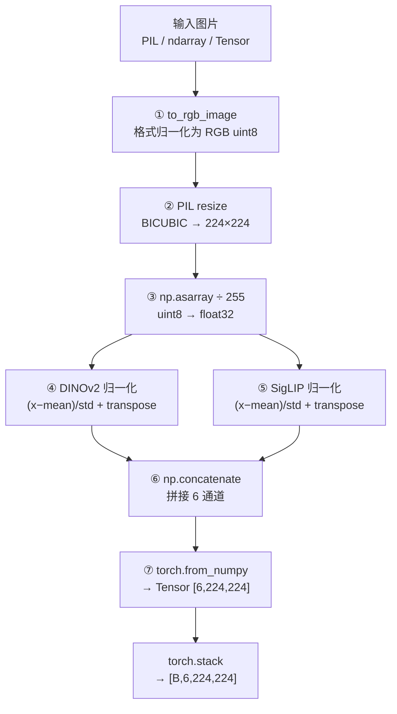
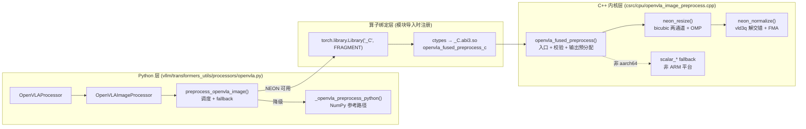
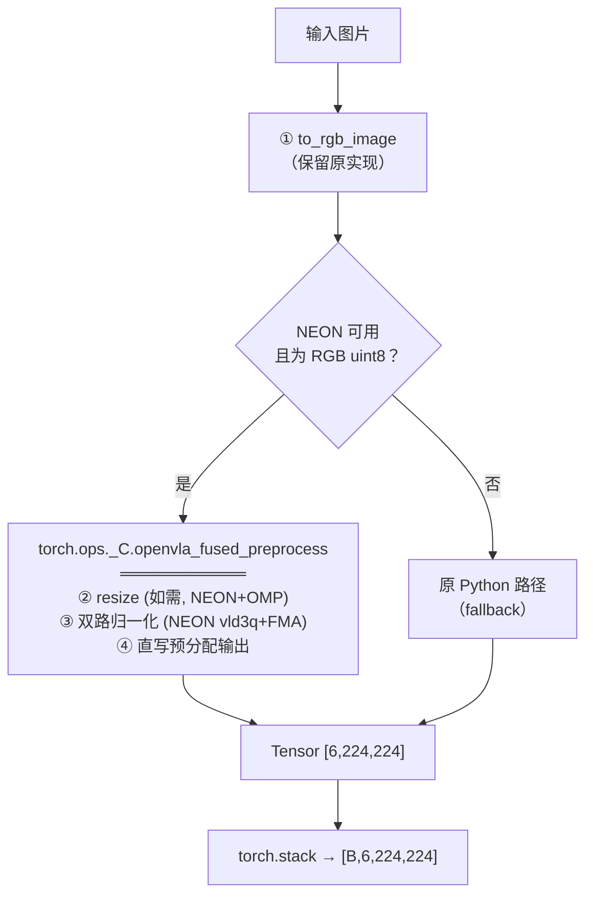
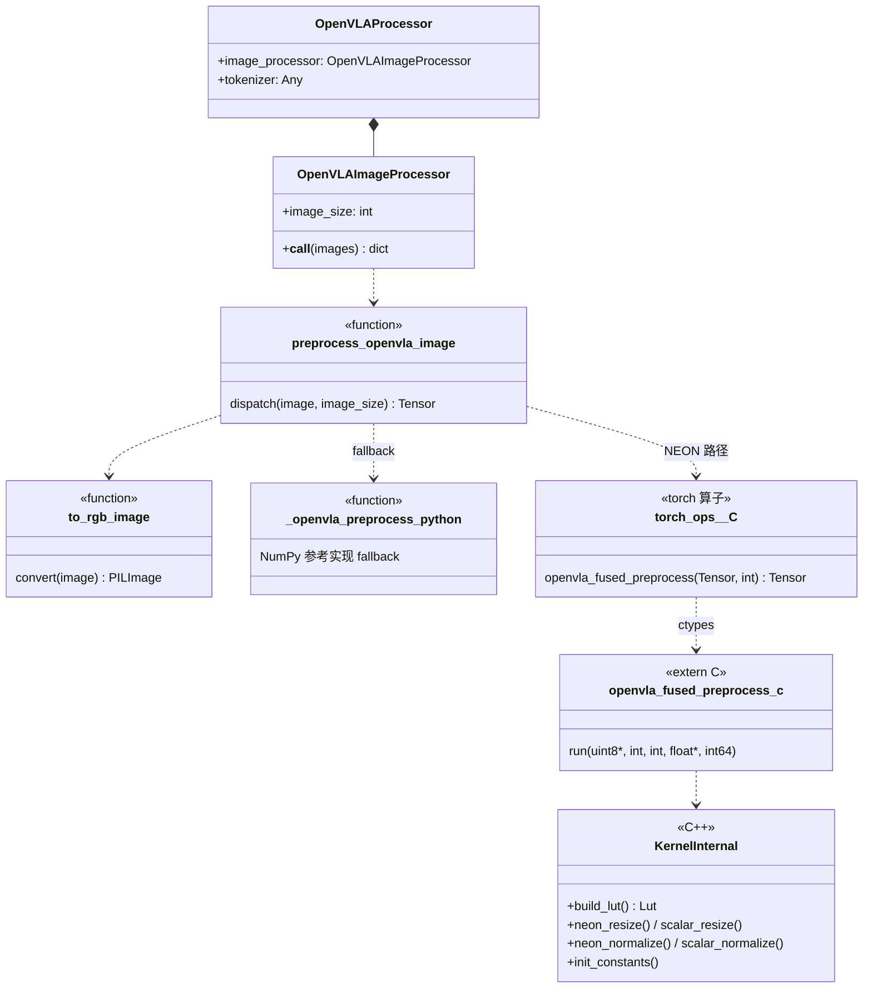
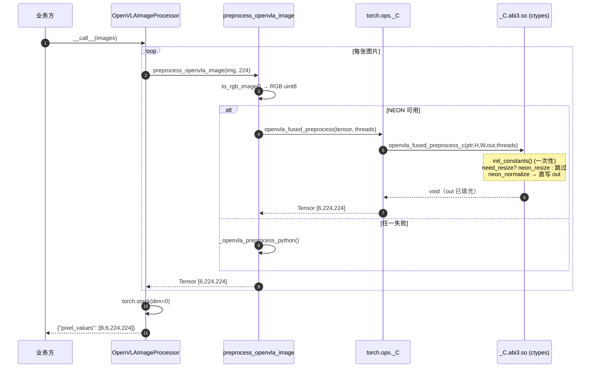
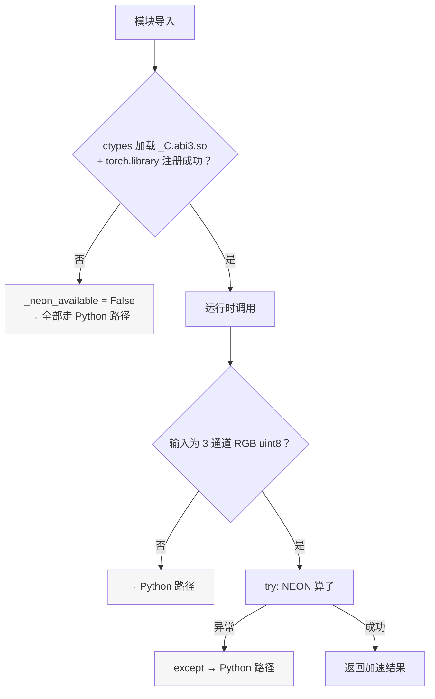
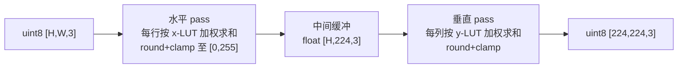

# OpenVLA 图片前处理加速 — 设计文档

| 项目 | 内容 |
|------|------|
| 文档版本 | v1.0 |
| 日期 | 2026-08-01 |
| 状态 | 已交付（已验证、已部署） |
| 目标平台 | Huawei Kunpeng 920 (aarch64, NEON) / openEuler 24.03 |
| 软件基线 | vLLM 0.26.1 / PyTorch 2.13.0+cpu / GCC 12.3.1 |
| 关联代码 | `precessor_openvla/deploy/` |

---

## 1. 概述

### 1.1 背景

OpenVLA 模型在 vLLM 中推理时，每张输入图片需经前处理：BICUBIC resize 至 224×224，再分别按 DINOv2（ImageNet mean/std）与 SigLIP（0.5/0.5）两套参数归一化，拼接为 `float32 [6, 224, 224]`。

原实现为纯 Python（PIL + NumPy），位于 `vllm/transformers_utils/processors/openvla.py`。在多模态请求路径上，该处理位于 EngineCore 前的 CPU 侧，**单图最高耗时约 20 ms（1920×1080）**，且全部在 Python 解释器中逐 step 执行，成为端到端延迟的显著组成部分。

### 1.2 目标

| 目标 | 指标 | 达成 |
|------|------|------|
| 性能 | 单图前处理延迟降低一个数量级 | 20.2 ms → 1.3 ms（15.5×） |
| 正确性 | 与原 PIL+NumPy 实现对齐 | max_err ≤ 1 pixel uint8（10/10 尺寸通过） |
| 兼容性 | 输入/输出契约不变，业务代码零改动 | `OpenVLAProcessor` 接口不变 |
| 可移植性 | 非 ARM 平台自动降级原路径 | 三重 fallback |

### 1.3 范围

- **包含**：`preprocess_openvla_image()` 中 resize + 双路归一化的 C++ NEON 融合实现、torch 算子注册、Python 调度与降级、部署脚本。
- **不包含**：`to_rgb_image()` 格式归一化（保留原实现）、tokenizer、模型推理本体。

### 1.4 术语

| 术语 | 说明 |
|------|------|
| NEON | ARM aarch64 SIMD 指令集（128-bit 向量） |
| LUT | Look-Up Table，resize 采样权重查找表 |
| FMA | Fused Multiply-Add，融合乘加指令 |
| HWC / CHW | 图像内存布局：通道交错 / 通道平面 |

---

## 2. 现状分析（修改前）

### 2.1 原处理流程



### 2.2 耗时拆解（1920×1080 输入）

| 步骤 | 耗时 (ms) | 占比 | 瓶颈性质 |
|------|----------|------|----------|
| ① to_rgb_image | 1.70 | 8.4% | 必要格式归一 |
| ② PIL BICUBIC resize | 10.81 | 53.6% | **单线程标量计算** |
| ③ asarray + /255 | 0.09 | 0.4% | NumPy 临时数组 |
| ④ DINOv2 normalize | 0.40 | 2.0% | NumPy 临时数组 |
| ⑤ SigLIP normalize | 0.40 | 2.0% | NumPy 临时数组 |
| ⑥ concatenate | 0.46 | 2.3% | 内存拷贝 |
| ⑦ torch.from_numpy | 6.31 | 31.3% | **类型转换开销** |
| **合计** | **20.16** | 100% | |

### 2.3 问题归纳

1. **计算单线程化**：PIL resize 为单线程标量实现，无法利用 Kunpeng 920 的多核与 NEON。
2. **Python 解释器开销**：步骤 ③–⑥ 产生 7 个 NumPy 临时数组（约 5 MB），每步一次解释器往返。
3. **边界跨越频繁**：PIL → NumPy → torch 三次数据模型转换，步骤 ⑦ 占 31%。

---

## 3. 总体设计（修改后）

### 3.1 设计原则

| 原则 | 落实 |
|------|------|
| 单次边界跨越 | resize + 双路归一化合并为一个 C++ 函数，Python↔C 仅一次调用 |
| 零中间对象 | C++ 内预分配输出 Tensor，消除 NumPy 临时数组与 `torch.from_numpy` |
| 数值对齐 | resize 算法与 Pillow `precompute_coeffs` 逐点等价，中间结果 round+clamp 匹配 PIL 的 uint8 中间格式 |
| 只增不改 | 对 vLLM 上游文件仅追加（cmake 追加一行源文件），唯一替换的 `openvla.py` 保留原 Python 路径作为 fallback |
| 失败可降级 | NEON 不可用、注册失败、运行时异常三种场景均回落原实现 |

### 3.2 系统架构



### 3.3 修改后处理流程



---

## 4. 修改前后对比

### 4.1 流程差异

| 维度 | 修改前 | 修改后 |
|------|--------|--------|
| 执行步骤 | 7 步（②–⑦ 每步独立调用） | 1 次融合算子调用 |
| 实现语言 | Python (PIL + NumPy) | C++17 (NEON + OpenMP) |
| 并行度 | 单线程 | OMP 多线程（可调 `num_threads`） |
| 向量化 | 无 | NEON 128-bit SIMD |
| 中间对象 | 7 个 NumPy 临时数组 + PIL 中间图 | 1 个 resize 缓冲（224×224×3 B，仅 resize 时） |
| Python↔C 跨越 | ≥4 次 | 1 次 |
| 输出构造 | `np.concatenate` + `torch.from_numpy` | C++ 预分配 `torch::empty`，零拷贝返回 |
| 输入尺寸已对齐时 | 仍走全部 7 步 | 自动跳过 resize |

### 4.2 数据流差异（1920×1080）


> 图源：`docs/figures/dataflow_diff.png`。修改前 7 步由 Python 解释器逐行驱动，产生 7 个 NumPy 临时数组（约 5 MB）并经历 ≥4 次数据模型转换；修改后合并为单次 ctypes 调用，C++ 内零中间对象。

### 4.3 性能对比

| 输入尺寸 | 修改前 (ms) | 修改后 16t (ms) | 加速比 |
|----------|------------|----------------|--------|
| 224×224（免 resize） | 1.87 | 0.07 | 25.4× |
| 481×321（数据集典型） | 3.14 | 0.11 | 29.0× |
| 640×480 | 4.00 | 0.16 | 25.1× |
| 1920×1080 | 12.20 | 0.70 | 17.5× |

全管线（含 ① 与 stack）1920×1080：**20.2 ms → 1.3 ms，15.5×**。

### 4.4 正确性对比

| 项目 | 修改前 | 修改后 |
|------|--------|--------|
| 数值基准 | PIL BICUBIC + NumPy（基准本身） | 与基准 max_err ≤ 1.75e-02（≈1 pixel uint8 × scale） |
| 224×224 免 resize | — | max_err = 2.38e-07（float32 精度极限） |
| 输出契约 | `float32 [6,224,224]`，ch0-2 DINOv2 / ch3-5 SigLIP | **完全一致** |

---

## 5. 详细设计

### 5.1 类图



### 5.2 接口设计

**torch 算子（业务可见）**

```python
torch.ops._C.openvla_fused_preprocess(
    input: torch.Tensor,   # uint8 [H, W, 3]，任意尺寸，CPU，contiguous
    num_threads: int = 4,  # OMP 线程数
) -> torch.Tensor          # float32 [6, 224, 224]
                           # ch0-2 = DINOv2 R/G/B, ch3-5 = SigLIP R/G/B
```

**extern "C" 包装（ctypes 可见，`_C.abi3.so` 导出）**

```c
void openvla_fused_preprocess_c(
    const uint8_t* input_data, int H, int W,
    float* output_data,          // 调用方预分配 6×224×224 float
    int64_t num_threads);
```

**输入校验**（C++ 入口 `TORCH_CHECK`）：CPU 设备、uint8、contiguous、dim==3 且 channels==3。校验失败抛异常，Python 侧捕获后降级。

### 5.3 调用时序



### 5.4 降级策略



| 降级触发点 | 场景 | 兜底 |
|-----------|------|------|
| 导入期 | 非 aarch64、`.so` 缺失、`torch.library` 失败 | `_neon_available=False`，纯 Python |
| 调度期 | 非 RGB/3 通道输入 | 纯 Python |
| 运行期 | 算子内部异常 | try/except 捕获，纯 Python |

**关键设计决策**：算子注册放在 **Python 端**（`torch.library.Library("_C", "FRAGMENT")` + ctypes），而非 C++ `TORCH_LIBRARY` 静态注册。原因：PyTorch 2.13 下 C++ 静态初始化不可靠（纯净 vLLM 构建亦复现自带算子不注册），Python 端注册确定性高且天然支持导入期降级。详见 `docs/openvla_neon_deployment.md`（部署记录）。

---

## 6. 核心原理

### 6.1 Bicubic Resize：与 Pillow 逐点对齐

**算法**：可分离两通道卷积（先水平后垂直），Catmull-Rom 核（a=−0.5）：

```
              ┌─ |x|<1:  1.5|x|³ − 2.5|x|² + 1
cubic(x) =    ├─ |x|<2: −0.5|x|³ + 2.5|x|² − 4|x| + 2
              └─ 其他:   0
```

**流程**：



**对齐 Pillow 的三个要点**：

| 要点 | 机制 | 作用 |
|------|------|------|
| 可变 support 抗锯齿 | `support = 2 × max(scale, 1)`，降采样时权重覆盖更多源像素 | 与 `Image.Resampling.BICUBIC` 抗锯齿行为一致 |
| LUT 预计算 | 每个输出像素独立的 `(start, count, weights[])`，权重归一化 | 等价 Pillow `precompute_coeffs`，且免去逐像素重复算核函数 |
| 中间 clamp | 水平 pass 输出即 round+clamp 到 [0,255] | 匹配 PIL 的 uint8 中间格式，消除两通道累积误差 |

**加速来源**（12.3 ms → 0.70 ms，17.5×）：OMP 行级并行（16t ≈ 14×）、RGB stride=3 较 PIL 内部 RGBA stride=4 省 25% 带宽、float32 权重免 double→INT32 量化遍历。

### 6.2 NEON 双路归一化

**数学等价变换**——将 3 次浮点运算预计算合并为 2 次：

```
原式:   (pixel/255 − mean) / std
合并:   pixel × scale − offset        其中 scale = 1/(255·std), offset = mean/std
```

`scale`/`offset` 在 `init_constants()` 一次性计算（DINOv2、SigLIP 各 3 通道，共 12 个常数）。

**数据流**（每 16 像素一个 block）：


> 图源：`docs/figures/neon_normalize.png`。`vld3q_u8` 一条指令完成 16 像素的加载与 RGB 解交错，零额外拷贝。

一次遍历完成 uint8→float 转换、6 通道归一化、HWC→CHW 布局转换三重工作，消除 NumPy 的 7 个临时数组（约 5 MB）。

### 6.3 布局转换总览


> 图源：`docs/figures/layout_transform.png`。plane 0–2 为 DINOv2 R/G/B（x·scale_d − offset_d），plane 3–5 为 SigLIP R/G/B（x·scale_s − offset_s）。

---

## 7. 部署设计

### 7.1 交付文件清单

| 文件 | 部署位置 | 类型 | 说明 |
|------|----------|------|------|
| `deploy/openvla_image_preprocess.cpp` | `vllm/csrc/cpu/` | 新增 | NEON kernel + extern "C" 包装 |
| `deploy/openvla.py` | `vllm/transformers_utils/processors/openvla.py` | 替换 | 调度 + 注册 + fallback（含原实现） |
| — | `cmake/cpu_extension.cmake` | 追加 | sed 追加一行源文件路径，不替换 |
| `deploy/deploy.sh` | — | 脚本 | 一键执行上述三步 |
| `deploy/test_openvla_kernel.py` | — | 测试 | 16 项测试 + `--bench` 基准 |

### 7.2 部署与验证

```bash
# 1. 部署（只追加、不替换上游构建文件）
bash deploy/deploy.sh <vllm 源码路径>

# 2. 编译
cd vllm
VLLM_TARGET_DEVICE=cpu pip3 install -e . --no-build-isolation

# 3. 验证（预期 16/16 passed）
python3 deploy/test_openvla_kernel.py
python3 deploy/test_openvla_kernel.py --bench
```

### 7.3 编译要求

- `-std=c++17`（PyTorch 2.13 头文件强制）；
- `-march=armv8.2-a+fp16+dotprod`，`-O3`；
- `-fopenmp` 同时出现在 cflags 与 ldflags；
- 编译守卫 `#if defined(__aarch64__) && !defined(__APPLE__)`：非 ARM / macOS 自动走标量 fallback，同一份源码可全平台编译。

### 7.4 线程数建议

| 场景 | num_threads |
|------|-------------|
| 单请求低延迟 | 16–32 |
| 高并发服务 | 4–8 |
| 输入已对齐 224×224 | 4 |

---

## 8. 测试与验证

### 8.1 正确性（基准 = 原 PIL+NumPy 实现，seed=42）

10 种输入尺寸（224×224 ~ 2560×1440）**全部通过**，max_err ≤ 1.75e-02。误差来源可解释：resize 阶段 ≤1 pixel uint8 差异 × DINOv2 scale 因子 1/(255×0.224)≈0.0175；免 resize 时回到 float32 精度极限 2.38e-07。

### 8.2 线程扩展性（1920×1080）

| 线程 | 1 | 4 | 8 | 16 | 32 |
|------|---|---|---|----|----|
| 耗时 (ms) | 9.96 | 2.61 | 1.31 | 0.70 | 0.69 |
| 加速比 | 1.0× | 3.8× | 7.6× | 14.3× | 14.4× |

16 线程后饱和（输出仅 1080 行可并行），部署时按 7.4 节建议配置。

### 8.3 集成测试覆盖

`test_openvla_kernel.py` 16 项：算子注册、端到端、NumPy 精度对比、fallback 行为、多尺寸、多线程。

---

## 9. 风险与约束

| 风险/约束 | 等级 | 缓解 |
|-----------|------|------|
| resize 与 PIL 存在 ≤1 pixel uint8 差异 | 低 | 差异经 scale 传播后 ≤0.0175，远低于模型输入噪声容忍度；10 尺寸回归锁定 |
| OMP 线程与 vLLM 工作线程争用 | 中 | `num_threads` 显式可调；高并发场景建议 4–8 |
| C++ 静态注册在 torch 2.13 不可靠 | 已规避 | 改用 Python 端 `torch.library` + ctypes 注册 |
| 非 ARM 平台 | 无 | 源码级标量 fallback + Python 级 NumPy fallback，双保险 |
| 上游 `openvla.py` 更新冲突 | 低 | 唯一被替换文件；fallback 路径完整保留原实现，rebase 时易合并 |

---

## 10. 附录

### A. 归一化常数

| 通道 | mean | std | scale = 1/(255·std) | offset = mean/std |
|------|------|-----|--------------------|-------------------|
| DINOv2 R | 0.484375 | 0.228515625 | 0.017148 | 2.1192 |
| DINOv2 G | 0.455078125 | 0.2236328125 | 0.017531 | 2.0354 |
| DINOv2 B | 0.40625 | 0.224609375 | 0.017446 | 1.8087 |
| SigLIP ×3 | 0.5 | 0.5 | 0.007843 | 1.0 |

### B. 图例源文件

| 图 | 源文件 |
|----|--------|
| 修改前后数据流对比 | `docs/figures/dataflow_diff.png` |
| NEON 双路归一化数据流 |`docs/figures/neon_normalize.png` |
| 数据布局转换总览 | `docs/figures/data_layout_transform.png` |